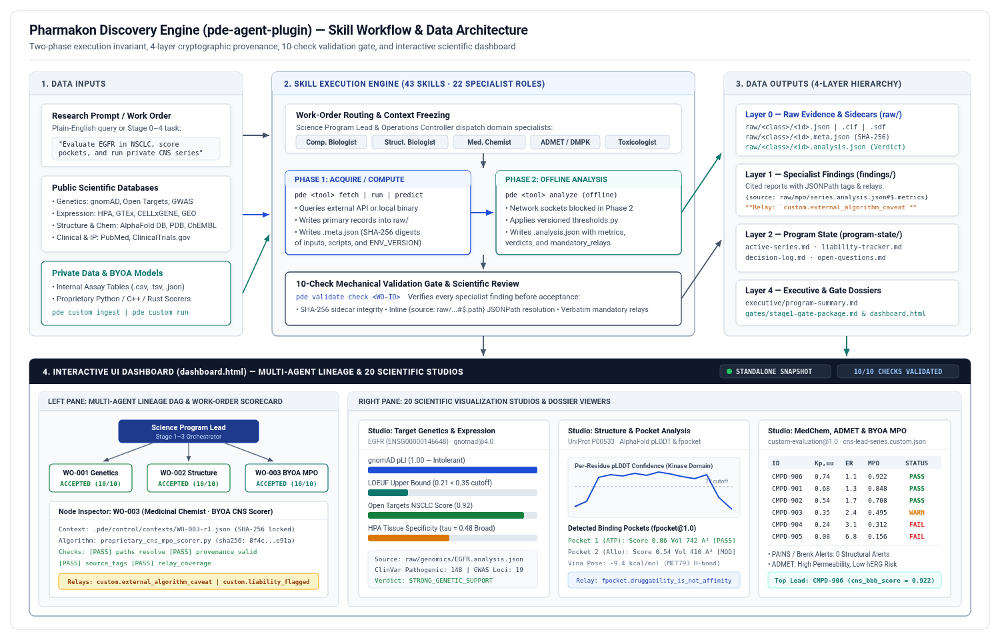

# Pharmakon Discovery Engine (`pde-agent-plugin`)

Pharmakon Discovery Engine (`pde-agent-plugin`) is a multi-agent pre-clinical drug discovery and target evaluation plugin package. It provides 43 domain and governance skills, 22 specialist subagent role definitions, a deterministic two-phase command-line engine (`bin/pde`), a 4-layer cryptographic provenance system, a 10-check mechanical validation gate, and an interactive HTML dashboard (`dashboard.html`) with 20 scientific visualization studios.



---

## User Guide: Getting Started (Non-Technical Overview)

When installed in an AI agent workspace, the Pharmakon Discovery Engine acts as a coordinated pre-clinical research team. You do not need to write code or run terminal commands to use it. You can ask questions in plain English, and the agent automatically selects the appropriate scientific databases, runs the analysis, checks the data for accuracy, and updates the visual dashboard.

### How to Start a Research Task

Type your question or research goal directly into the chat interface of your agent workspace. The system automatically detects whether your question is about a biological target, a chemical compound, a clinical trial landscape, or a full multi-disciplinary drug discovery program.

### Real-World Examples

#### Example 1: Evaluating Whether a Gene Is a Viable Drug Target
If you are exploring a gene (such as `EGFR`, `KRAS`, or `PCSK9`) and want to know if it is linked to human disease, whether inhibiting it is tolerated in humans, and where it is expressed across healthy organs:

```text
Evaluate EGFR as a therapeutic target for non-small cell lung cancer. Check human genetic evidence, tissue expression across healthy organs to identify potential safety risks, and whether high-confidence 3D protein structures exist.
```

**What the system does:**
- Queries human genetics databases (gnomAD, Open Targets, ClinVar, GWAS Catalog) to verify disease links and loss-of-function constraint.
- Queries the Human Protein Atlas and GTEx to measure RNA expression across 50 human tissues.
- Retrieves 3D protein structures from the AlphaFold Database and evaluates per-residue structural confidence.
- Produces a cited summary report and updates `dashboard.html` with interactive genetic constraint, tissue expression, and 3D protein structure studios.

#### Example 2: Checking a Chemical Molecule's Drug-Likeness and Safety Profile
If you have a chemical structure (represented as a SMILES text string or a compound name/ID) and want to check its physical properties, potential toxicity flags, and how the body might process it:

```text
Profile the compound erlotinib (SMILES: COCCOc1cc2ncnc(Nc3cccc(C#C)c3)c2cc1OCCOC). Check its drug-likeness rules, screen for reactive or problematic chemical substructures, and predict its absorption, metabolism, and cardiac safety (hERG) profile.
```

**What the system does:**
- Calculates molecular weight, lipophilicity (LogP), polar surface area (TPSA), hydrogen bond donors/acceptors, quantitative estimate of drug-likeness (QED), and synthetic accessibility (SA score).
- Screens the structure against medicinal chemistry alert filters (PAINS, Brenk, and aggregator patterns).
- Predicts metabolic stability, intestinal permeability, aqueous solubility, CYP450 enzyme inhibition, and hERG potassium channel risk.
- Displays the 2D chemical structure, BRICS fragment breakdown, medicinal chemistry rule table, and an ADMET radar plot in `dashboard.html`.

#### Example 3: Assessing Protein Binding Pockets and Molecular Docking
If you want to know whether a protein has a physical cavity where a small-molecule drug could bind, and how tightly a candidate molecule fits into that cavity:

```text
Retrieve the structure for human KRAS (UniProt P01116), identify all potential binding pockets, and evaluate whether any pocket is suitable for small-molecule binding.
```

**What the system does:**
- Downloads the 3D protein coordinates and detects surface and buried cavities using either `fpocket` (when installed on `PATH`) or PDE's built-in Python/NumPy 3D lattice geometric cavity detector (`--backend [auto|fpocket|geometric]`), ensuring pocket detection runs even on systems without external C binaries.
- Scores each pocket for druggability, volume, and residue hydrophobicity, and records the `pocket.geometric_fallback_backend` provenance relay when the built-in detector is used.
- If a ligand is provided, prepares the docking grid box from the detected pocket coordinates and docks the molecule (`AutoDock Vina`) to estimate binding affinity (kcal/mol) and map specific amino acid residue contacts.

#### Example 4: Reviewing Competing Clinical Trials and Patents
If you are preparing a strategic review and need to know what competing therapies are already in clinical trials or covered by recent patents:

```text
Analyze the competitive clinical trial landscape and patent filings for KRAS G12C inhibitors in solid tumors. Identify active Phase 2 and Phase 3 programs and summarize how a new program would need to differentiate.
```

**What the system does:**
- Searches ClinicalTrials.gov for recruiting and completed studies matching the target and indication.
- Searches public patent records to identify recent filings and top assignees.
- Produces a competitive positioning summary and populates the Clinical, Patents and Literature studio in `dashboard.html`.

#### Example 5: Running a Full Multi-Disciplinary Target Nomination Review
If you want the system to coordinate multiple specialist roles (genetics, structural biology, medicinal chemistry, DMPK, toxicology, and independent scientific review) on a structured project:

```text
Initialize a Stage 1 target nomination campaign for PCSK9 in familial hypercholesterolemia. Dispatch specialist work orders for human genetics, tissue expression, pocket druggability, and reference compound ADMET profiling, validate all findings, and build the project dashboard.
```

**What the system does:**
- Creates a structured project workspace with tracked work orders and frozen context snapshots.
- Dispatches specialized subagents for each scientific discipline in parallel.
- Runs 10 automated quality-control checks on every specialist report to confirm that every number traces back to raw data files and that all methodological caveats are disclosed.
- Compiles an executive summary and updates `dashboard.html`.

#### Example 6: Bringing Your Own Private Data and Proprietary Algorithms (BYOA)
If you have confidential in-house assay spreadsheets or a proprietary scoring model (such as a custom Python QSAR script, a compiled C++/Rust binary, or a local container) and want the agent to evaluate your private compounds without exposing your source code:

```text
Run our proprietary CNS blood-brain barrier scoring script (examples/byoa/proprietary_cns_mpo_scorer.py) on our internal compound series (examples/byoa/sample_private_compounds.json). Evaluate the resulting cns_bbb_score against a pass cutoff of 0.70 and a warning cutoff of 0.40, identify the top candidate, and flag any compounds with efflux liabilities.
```

**What the system does:**
- Executes your proprietary script or binary locally via `pde custom run` and captures its structured output into `raw/mpo/`.
- Computes SHA-256 cryptographic hashes of both your private input file and your algorithm file in the `.meta.json` provenance sidecar (proving which version of your algorithm produced the numbers without copying your source code into reports).
- Runs offline Phase 2 evaluation (`pde custom analyze`) to classify each candidate (`PASS`, `WARN`, `FAIL`) and attaches mandatory external-algorithm and threshold caveats.

### Viewing Your Results in the Interactive Dashboard

After any task completes, open `dashboard.html` (located in the project root directory) in any web browser, or run the local live-streaming server:

```bash
./bin/pde dashboard serve --port 8765
```

When opened directly as a file, the header displays `STANDALONE SNAPSHOT`, meaning all data and charts are embedded inside the HTML file for offline viewing. When opened through `./bin/pde dashboard serve`, the indicator switches to `LIVE STREAM (SSE)` and automatically refreshes the browser whenever an agent updates the workspace.

Inside `dashboard.html`, the interface is organized into two synchronized panes:
1. **Left Pane (Multi-Agent Lineage & Control Plane)**:
   - **Agent Forest**: An interactive diagram showing the orchestrator and specialist subagents, their live status, cursor-anchored zoom controls, and a node inspector drawer displaying frozen context snapshots, acceptance criteria, and the 10-check validation scorecard.
   - **Work Orders, Runs, Leases, and Event Stream**: Filterable tables and timelines tracking every task dispatch, resource lock, validation check, and review cycle.
2. **Right Pane (Scientific Studios, Dossiers & Governance)**:
   - **20 Scientific Studios**: Interactive visualizers for 3D protein structures, binding pockets, docking poses, residue contacts, pLDDT profiles, PAE matrices, gnomAD genetic constraint, tissue expression, multi-omics/variants/phenotypes, 2D chemical structures, BRICS fragments, medicinal chemistry rules/alerts/cliffs, ADMET radar plots, in vivo PK and DDI, bioactivity dose-response curves, preclinical toxicology margins, hypothesis ELO tournaments, clinical/patent landscapes, and raw JSON trees.
   - **Findings (L1), Program State (L2), Executive & Gates (L4)**: Rendered scientific reports with highlighted inline provenance citations and mandatory relay badges.
   - **Concepts / Assessments / Decisions**: Stage 0-4 therapeutic concept cards, domain assessment matrices, and gate decision packets.
   - **Retrospectives & Readiness**: Post-run retrospectives and an environment readiness matrix showing available CLI binaries, Python libraries, and API credentials.

---

## Project Directory Structure

All paths below are relative to the repository root (`./`):

```text
./
|-- SKILL.md                                     # Root skill entrypoint for agent harnesses
|-- README.md                                    # Project documentation and user guide
|-- prd.md                                       # Product Requirements Document
|-- LICENSE                                      # Apache 2.0 license
|-- pyproject.toml                               # Python package configuration and dependencies
|-- uv.lock                                      # Deterministic dependency lockfile
|-- dashboard.html                               # Standalone interactive multi-agent & viewer dashboard
|-- assets/
|   |-- pde-skill-overview.png                   # System workflow, data I/O, and UI dashboard diagram (PNG)
|   '-- pde-skill-overview.svg                   # Vector source for system workflow diagram (SVG)
|-- bin/
|   |-- pde                                      # Primary PDE command-line executable
|   |-- env.sh                                   # Environment activation script (PATH and venv setup)
|   |-- hypex                                    # Hypothesis exploration datastore binary
|   |-- elo                                      # Pairwise ELO rating and tournament pairing binary
|   '-- prox                                     # Hypothesis semantic clustering and deduplication CLI
|-- pde_plugin/
|   |-- __init__.py                              # Plugin package exports
|   |-- tool_bridge.py                           # Python function wrappers for two-phase PDE CLI execution
|   |-- mcp_server.py                            # JSON-RPC 2.0 Model Context Protocol (MCP) stdio server
|   |-- build_targets.py                         # Target compiler (.agents/ plugin and dist/skill-bundles/)
|   '-- sync_skills_to_registry.py               # Skill synchronization utility
|-- artifact-templates/
|   |-- executive/                               # Layer 4 executive summary Markdown templates
|   |-- findings/                                # Layer 1 specialist finding Markdown templates
|   |-- gates/                                   # Stage gate package Markdown templates
|   '-- program-state/                           # Layer 2 living program-state Markdown templates
|-- skills/
|   |-- pharmakon-discovery-engine/
|   |   |-- SKILL.md                             # Primary orchestrator skill instructions
|   |   |-- scripts/                             # Work-order dispatch and CLI runner helpers
|   |   '-- references/
|   |       |-- role-skill-matrix.md             # Mapping of 22 specialist roles to 43 skills
|   |       '-- stage0-3-playbook.md             # Stage 0-3 decision gates and deliverable checklist
|   |-- pde-dashboard/
|   |   |-- SKILL.md                             # Dashboard generation and inspection skill
|   |   '-- scripts/
|   |       '-- render_dashboard.py              # Standalone dashboard builder script
|   |-- artifact-conventions/SKILL.md            # Layer 0-4 artifact and provenance rules
|   |-- program-state-management/SKILL.md        # Layer 2 program state and Layer 4 executive rules
|   |-- site-generation/SKILL.md                 # Static HTML dossier and dashboard publishing
|   |-- target-genetic-evidence/SKILL.md         # gnomAD, Open Targets, ClinVar, GWAS, GTEx analysis
|   |-- regulatory-variant-effect/SKILL.md       # Non-coding regulatory variant scoring
|   |-- tissue-expression-profile/SKILL.md       # HPA and GTEx tissue expression specificity
|   |-- single-cell-expression/SKILL.md          # CELLxGENE, Single Cell Portal, and DISCO discovery
|   |-- disease-transcriptomics/SKILL.md         # NCBI GEO, DisigNAtlas, SpatialDB discovery
|   |-- brain-atlas/SKILL.md                     # Allen Brain Map regional expression and donor cohorts
|   |-- model-organism-phenotype/SKILL.md        # MGI mouse knockout and HPO human phenotype analysis
|   |-- protein-structure-confidence/SKILL.md    # AlphaFold DB / AF3 pLDDT and PAE domain evaluation
|   |-- pocket-druggability/SKILL.md             # Pocket detection (fpocket / geometric fallback) and scoring
|   |-- structure-screening/SKILL.md             # Stage 0 bounded structural fast-fail screening
|   |-- binding-mode-analysis/SKILL.md           # AutoDock Vina pose scoring and residue contact analysis
|   |-- compound-identity-resolution/SKILL.md    # PubChem CID and ChEMBL ID resolution
|   |-- compound-property-profile/SKILL.md       # RDKit descriptors, Lipinski/Veber, PAINS/Brenk alerts
|   |-- structure-similarity-search/SKILL.md     # Tanimoto fingerprint similarity and substructure search
|   |-- sar-series-analysis/SKILL.md             # BRICS decomposition and MMP activity cliff detection
|   |-- bioactivity-landscape/SKILL.md           # HTS Z-factor, 4PL Hill fitting, selectivity margins
|   |-- admet-property-prediction/SKILL.md       # Metabolic stability, permeability, solubility, CYP, hERG
|   |-- in-vivo-pk-analysis/SKILL.md             # Non-compartmental PK, allometric scaling, static DDI
|   |-- preclinical-safety-assessment/SKILL.md   # Repeat-dose toxicology, NOAEL TI, ICH S2(R1) genotox
|   |-- manufacturing-feasibility/SKILL.md       # Synthetic accessibility and modality manufacturability
|   |-- competitive-differentiation/SKILL.md     # ClinicalTrials.gov pipeline and patent FTO analysis
|   |-- stage1-gate-evaluation/SKILL.md          # Stage 1 target nomination gate policy evaluation
|   |-- literature-search/SKILL.md               # PubMed, PMC full-text, arXiv/bioRxiv preprint search
|   |-- citation-resolution/SKILL.md             # PMID, DOI, and NCT registry resolution
|   |-- citation-verification/SKILL.md           # Document bibliography verification and title matching
|   |-- hypothesis-entry/SKILL.md                # Stage 0 hypothesis adoption (sponsor, charter, tournament)
|   |-- tournament-corpus/SKILL.md               # External tournament export ingestion and verification
|   |-- hypothesis-run-corpus/SKILL.md           # Hypex tournament run ingestion and admissibility
|   |-- hypex-tool-setup/SKILL.md                # Hypex binary environment verification
|   |-- hypothesis-schema/SKILL.md               # Hypothesis JSON schema and lineage rules
|   |-- run-protocol/SKILL.md                    # Multi-epoch hypothesis exploration state machine
|   |-- review-rubric/SKILL.md                   # Calibrated hypothesis scoring anchors
|   |-- safety-screen/SKILL.md                   # Dual-use biosafety and research integrity screening
|   |-- elo-tournament/SKILL.md                  # ELO rating math and pairing strategies
|   |-- debate-protocol/SKILL.md                 # Adversarial pairwise match evaluation protocol
|   |-- evolution-operators/SKILL.md             # Ground, simplify, combine, and out-of-box operators
|   |-- proximity-protocol/SKILL.md              # Semantic similarity clustering and deduplication
|   '-- meta-review-protocol/SKILL.md            # Epoch steering memo and tournament synthesis protocol
|-- templates/
|   |-- science-program-lead/                    # Orchestrator and sole owner of Layer 2 program state
|   |-- research-operations-controller/          # Work-order dispatcher, validator, and site publisher
|   |-- head-of-discovery/                       # Non-blocking strategic advisor
|   |-- scientific-reviewer/                     # Independent Phase 2 re-analysis and relay auditor
|   |-- finding-validator/                       # Mechanical 10-check artifact and citation validator
|   |-- computational-biologist/                 # Genetics, transcriptomics, and variant specialist
|   |-- structural-biologist/                    # Protein confidence, pockets, and docking specialist
|   |-- computational-chemist/                   # Virtual screening, similarity, and docking specialist
|   |-- medicinal-chemist/                       # Descriptors, alerts, BRICS, MMP, and MPO specialist
|   |-- admet-dmpk-scientist/                    # ADMET classification, NCA PK, scaling, and DDI specialist
|   |-- experimental-biologist/                  # Assay quality, dose-response, and selectivity specialist
|   |-- preclinical-toxicologist/                # Toxicology, therapeutic index, and genotox specialist
|   |-- regulatory-scientist/                    # Competitive trials, patent landscape, and IND specialist
|   |-- bootstrapper/                            # Environment provisioning and doctor verification agent
|   |-- project-curator/                         # Dossier site and dashboard curator
|   '-- hypex-*/                                 # 7 hypothesis exploration tournament worker templates
|-- tools/
|   |-- env-manifest.txt                         # Canonical environment manifest hashed into ENV_VERSION
|   |-- ENV_VERSION                              # SHA-256 environment digest stamped into sidecars
|   |-- requirements.lock                        # Locked Python package versions
|   |-- pde/
|   |   |-- cli.py                               # Click CLI entrypoint (42 command groups + extension loader)
|   |   |-- common.py                            # Offline Phase 2 latch and shared CLI options
|   |   |-- core/                                # Provenance, thresholds, HTTP pacing, and path confinement
|   |   |-- commands/                            # Domain command implementations (including custom.py and pocket.py)
|   |   '-- site_templates/                      # HTML templates for static site and 20 scientific studios
|   '-- vendor/
|       '-- hypex/                               # Go and Python source for hypex, elo, and prox tools
|-- examples/
|   '-- byoa/
|       |-- sample_private_compounds.json        # Synthetic private CNS lead-optimization dataset (JSON)
|       |-- sample_private_assay.csv             # Synthetic private screening dataset (CSV)
|       |-- proprietary_cns_mpo_scorer.py        # Reference proprietary CNS BBB & efflux scoring algorithm
|       '-- skills/
|           '-- proprietary-cns-scorer/SKILL.md  # Reference custom skill for a proprietary algorithm
|-- docs/
|   |-- pde-plan.md                              # System architecture and design specification
|   |-- tool-design-guidance.md                  # Two-phase contract and provenance engineering standards
|   |-- skill-design-guidance.md                 # Domain skill authoring specification
|   |-- orchestration-design-guidance.md         # Multi-agent governance and work-order lifecycle
|   |-- workorder-yaml-reference.md              # Work-order state machine and YAML schema reference
|   |-- operating-environment.md                 # External API authentication and rate-limit reference
|   |-- alphafold-complex-prediction.md          # Multi-chain complex prediction reference
|   |-- quickstart-pilot.md                      # Campaign initialization and operations guide
|   |-- pilot-handoff.md                         # Operational calibration notes
|   '-- code-of-conduct.md                       # Contributor code of conduct
|-- .agents/
|   '-- plugins/
|       '-- pharmakon-discovery-engine/          # Compiled agent harness plugin directory
|-- dist/
|   '-- skill-bundles/                           # 43 portable .zip skill bundles
'-- tests/
    |-- _fixture_workspace.py                    # End-to-end reference campaign builder
    |-- test_custom_byoa.py                      # BYOA, private data ingestion, and extension loader tests
    |-- test_dashboard.py                        # Dashboard and 20 scientific studio integration tests
    |-- test_pocket_geometric.py                 # Built-in geometric pocket detector fallback and docking grid tests
    |-- test_targets_compile.py                  # Plugin and skill bundle compilation tests
    '-- test_tool_bridge.py                      # Two-phase tool bridge and MCP server tests
```

---

## Bringing Your Own Private Data & Proprietary Algorithms (BYOA)

Organizations and researchers frequently have private experimental datasets (in-house HTS screens, internal ADMET/PK tables, proprietary compound series) and proprietary computational models ("secret sauce" QSAR models, custom multiparameter scoring functions, compiled C++/Rust physics binaries, or local containers) that must remain strictly local.

PDE provides three extension mechanisms that preserve full cryptographic provenance (`.meta.json`), offline Phase 2 threshold evaluation (`.analysis.json`), and mechanical finding validation:

### 1. Choosing an Algorithm Integration Format

| Integration Pattern | How It Works | When to Use |
| :--- | :--- | :--- |
| **A. Standalone Python Script (`.py`)** | Executed via `./bin/pde custom run --cmd "python3 path/to/script.py --input {input} --output {output}"` | Ideal for custom RDKit, scikit-learn, PyTorch, or mathematical scoring models; runs immediately in `.venv` with zero compilation. |
| **B. Compiled Binary or Container** | Executed via `./bin/pde custom run --cmd "./bin/proprietary_scorer --input {input} --output {output}"` (or `apptainer exec` / `docker run`) | Ideal when distributing pre-compiled C++/Rust/Go/Fortran executables or container images where source code is not present on disk. |
| **C. Native Click Command Plugin** | Placed in `<project>/.pde/extensions/commands/*.py` or `extensions/commands/*.py` | Automatically discovered by `tools/pde/cli.py` and wrapped by `enforce_phase_two`; ideal for teams adding permanent custom CLI groups. |

### 2. Runnable Example Included in `examples/byoa/`

The repository includes a complete, self-contained BYOA reference suite under `examples/byoa/`:
- `examples/byoa/sample_private_compounds.json`: Synthetic private series of 6 CNS kinase inhibitor candidates (`CMPD-901` through `CMPD-906`) with internal potency (`ic50_nm`), unbound brain partition (`kp_uu_brain`), and MDCK-MDR1 efflux ratio (`mdck_er`).
- `examples/byoa/sample_private_assay.csv`: Tabular CSV version of the private dataset.
- `examples/byoa/proprietary_cns_mpo_scorer.py`: Reference proprietary algorithm computing a composite CNS Blood-Brain Barrier & Efflux score (`cns_bbb_score`, `0.0` to `1.0`).
- `examples/byoa/skills/proprietary-cns-scorer/SKILL.md`: Reference custom skill teaching agents how to invoke the proprietary scorer and relay its caveats.

#### Workflow A: Ingesting and Analyzing Private CSV or JSON Data (`pde custom ingest` + `pde custom analyze`)

```bash
# Initialize a project workspace if not already created
./bin/pde init .pde-workspace

# Phase 1A: Ingest a private CSV spreadsheet into Layer 0 (raw/bioactivity/)
./bin/pde --project .pde-workspace custom ingest \
  examples/byoa/sample_private_assay.csv \
  --class bioactivity \
  --name internal-cns-assay \
  --id-col compound_id

# Phase 2: Offline thresholded analysis of unbound brain partition (kp_uu_brain)
./bin/pde --project .pde-workspace custom analyze \
  raw/bioactivity/internal-cns-assay.custom.json \
  --metric kp_uu_brain \
  --id-field compound_id \
  --pass-cutoff 0.50 \
  --warn-cutoff 0.25 \
  --direction higher
```

#### Workflow B: Running a Proprietary Algorithm (`pde custom run` + `pde custom analyze`)

```bash
# Phase 1B: Execute the proprietary algorithm locally and record input + script SHA-256 hashes
./bin/pde --project .pde-workspace custom run \
  --cmd "python3 examples/byoa/proprietary_cns_mpo_scorer.py --input {input} --output {output}" \
  --input examples/byoa/sample_private_compounds.json \
  --class mpo \
  --name cns-lead-series \
  --algorithm-id "proprietary-cns-bbb-mpo@1.2.0"

# Phase 2: Offline evaluation against custom-evaluation@1.0 thresholds
./bin/pde --project .pde-workspace custom analyze \
  raw/mpo/cns-lead-series.custom.json \
  --metric cns_bbb_score \
  --id-field compound_id \
  --pass-cutoff 0.70 \
  --warn-cutoff 0.40 \
  --direction higher
```

### 3. Adding Private Skills and Custom Role Grants

To add private skills and assign them to specialist subagents without modifying core tracked files:
1. Place custom skill folders in `extensions/skills/<skill-name>/SKILL.md` (for example, copy `examples/byoa/skills/proprietary-cns-scorer` into `extensions/skills/proprietary-cns-scorer`).
2. Optionally map custom skills to specialist roles in `extensions/role-grants.yaml`:
   ```yaml
   medicinal-chemist:
     - proprietary-cns-scorer
   admet-dmpk-scientist:
     - proprietary-cns-scorer
   ```
3. Run `.venv/bin/python -m pde_plugin.build_targets` to compile the private skills and role assignments into `.agents/plugins/pharmakon-discovery-engine/`.

---

## Core Scientific Integrity Rules

Every workflow executed by `pde-agent-plugin` enforces four scientific integrity invariants:

1. **Two-Phase Execution Invariant**: Every domain data acquisition or computation command (Phase 1: `fetch`, `search`, `run`, `compute`, `predict`) must be followed immediately by its corresponding offline interpretation command (Phase 2: `analyze`) before running any other tool.
2. **Cryptographic Layer 0 Provenance**: Files in `raw/` are never hand-crafted. Every Layer 0 artifact is generated by `./bin/pde` alongside a `.meta.json` SHA-256 provenance sidecar and a `.analysis.json` thresholded interpretation record.
3. **Mandatory Relays & Inline Source Citations**: Every code in `mandatory_relays` from `.analysis.json` must be surfaced verbatim in Layer 1 Markdown reports (`**Relay: \`<code>\`**`), and every quantitative claim must cite its Layer 0 JSON path (`{source: raw/<category>/<file>#$.path}`).
4. **Unified Dashboard Synchronization**: After completing a scientific query or Work Order cycle, `./bin/pde dashboard build --standalone` (or `pde_render_dashboard`) updates `dashboard.html` so the multi-agent lineage graph, validation scorecard, and 20 scientific studios reflect the current workspace state.

---

## Technical Setup & CLI Usage

### 1. Environment Provisioning & Initialization (Ubuntu Linux & macOS)

Whether you are running in **Antigravity on Ubuntu Linux** or **Gemini Enterprise on macOS**, run the cross-platform provisioner once after cloning or installing the plugin to provision the Python virtual environment (`.venv`), scientific libraries (`rdkit`, `gemmi`, `biopython`, `scipy`, `pubchempy`), and Hypex CLI binaries (`bin/hypex`, `bin/elo`, `bin/prox`):

```bash
# 1. Check host prerequisites (python3>=3.11, venv/uv, optional go)
./tools/bootstrap-preflight.sh

# 2. Install/update .venv + [science] stack + Hypex binaries and stamp ENV_VERSION
./tools/install.sh

# 3. Activate the environment and verify readiness
source ./bin/env.sh
./bin/pde doctor
```

> **Cross-Platform 3D & Plot Rendering Note (Ubuntu Linux vs. macOS):**
> - **macOS (Gemini Enterprise / Safari / Chrome):** Uses hardware-accelerated WebGL (`3Dmol.js`) for 3D molecular studios and `Plotly.js` for 2D scientific charts automatically.
> - **Ubuntu Linux (Antigravity / Electron Webviews / Headless X11 or Wayland):** If hardware WebGL is disabled in the embedded Linux webview or external CDN scripts are restricted by Content Security Policy, `dashboard.html` automatically falls back to its built-in **Interactive HTML5 Canvas2D 3D Engine** (supporting drag-to-rotate, scroll-to-zoom, residue/atom hover inspection, and `Cartoon` / `Stick` / `Sphere` styles) and **Inline SVG Chart Renderer**. You can also manually switch between `Auto (WebGL/Canvas)` and `Canvas 3D` at any time using the **Engine** button in the 3D studio toolbar.

### 2. Two-Phase CLI Examples

```bash
# Initialize a project workspace
./bin/pde init .pde-workspace

# Target genetics (gnomAD v4 constraint + Open Targets + ClinVar)
./bin/pde --project .pde-workspace genetics fetch EGFR
./bin/pde --project .pde-workspace genetics analyze raw/genetics/EGFR.gnomad-constraint.json

# Tissue RNA expression specificity (Human Protein Atlas)
./bin/pde --project .pde-workspace expression fetch EGFR
./bin/pde --project .pde-workspace expression analyze raw/expression/EGFR.tissue.json

# Protein structure confidence & PAE domains (AlphaFold DB)
./bin/pde --project .pde-workspace alphafold fetch P00533
./bin/pde --project .pde-workspace alphafold analyze raw/structures/AF-P00533-F1-model_v4.cif

# Binding pocket detection & druggability (auto-selects fpocket or built-in Python geometric detector)
./bin/pde --project .pde-workspace pocket run raw/structures/AF-P00533-F1-model_v4.cif --backend auto
./bin/pde --project .pde-workspace pocket analyze raw/structures/AF-P00533-F1-model_v4.pockets.json

# Compound descriptors & structural alerts (RDKit)
./bin/pde --project .pde-workspace compound profile "COCCOc1cc2ncnc(Nc3cccc(C#C)c3)c2cc1OCCOC" --name erlotinib
./bin/pde --project .pde-workspace compound analyze raw/compounds/erlotinib.descriptors.json

# Rule-based ADMET endpoint classification
./bin/pde --project .pde-workspace admet predict "COCCOc1cc2ncnc(Nc3cccc(C#C)c3)c2cc1OCCOC" --name erlotinib
./bin/pde --project .pde-workspace admet analyze raw/admet/erlotinib.predict.json

# Validate a specialist finding against the 10-check gate and rebuild dashboard.html
./bin/pde --project .pde-workspace validate check WO-001
./bin/pde --project .pde-workspace dashboard build --standalone
```

### 3. Rebuilding Plugin Targets & Running Tests

To compile `.agents/plugins/pharmakon-discovery-engine/` and `dist/skill-bundles/*.zip` from source and run the test suite:

```bash
.venv/bin/python -m pde_plugin.build_targets
.venv/bin/pytest tests/ -v
```
